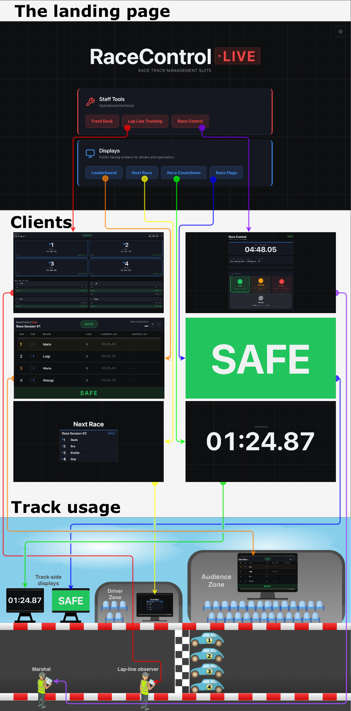

# RaceControl Live

A real-time race management suite for small race tracks (go-kart circuits, track days, club events). A marshal controls the race and flags, a lap-line observer records lap times by tapping a button as cars cross the line, and everyone (drivers, spectators, and staff) sees the same live state on dedicated display screens.

All clients are synchronised in real time over WebSockets, so every screen reflects the same race state within a few milliseconds: flag changes, countdowns, lap times, and session transitions.



## What it does

The app is a single system with multiple role-specific interfaces, accessed from a shared landing page:

### Staff interfaces (access-key protected)
- **Front Desk**: The receptionist creates race sessions, assigns driver names to car numbers (up to 8 per race), edits them, and confirms or deletes sessions.
- **Race Control**: The safety marshal selects the race duration, starts the race with a 3-second countdown, switches flag modes (Safe / Hazard / Danger), ends the race with the chequered flag, and closes out the session.
- **Lap Line Tracker**: The observer taps a large button for each car as it crosses the start/finish line, recording each lap. The server updates all connected displays in real time.

### Public displays
- **Leaderboard**: Live standings with current lap times, lap counts, session name, flag state, and race countdown. Fullscreen-ready. Sorted by most laps completed, with lowest total time as tiebreaker.
- **Next Race**: Shows the upcoming session's name and and driver names with assigned car numbers. Switches to a "Proceed to paddock" call (with chime) when the track is free. Meant for drivers waiting their turn.
- **Race Countdown**: Full-screen countdown clock with urgency colour states (normal / warning / critical / finished) and audio for the start countdown and "go".
- **Race Flags**: A large full-screen flag indicator (green / yellow / red / chequered) for trackside monitors.

### Other features
- **Persistent state**: Active sessions, timers, and race mode are written to `backend/data/races.json`, so an in-progress race survives a server restart and resumes with the correct remaining time.
- **Role-based access**: Front Desk, Race Control, and Lap Line Tracker each require a separate access key defined in the server environment. Keys are validated server-side and the socket's role is used to authorise every privileged event.
- **Dark / light theme**:Per-view theme toggle saved to `localStorage`.
- **LAN-friendly**: CORS is open by design so staff tablets and display TVs on the same local network can connect to the host machine without extra configuration.

## Tech stack
**Backend**
- Node.js
- Express.js
- Socket.IO

**Frontend**
- React
- React Router
- Socket.IO client
- Plain CSS (component-scoped stylesheets, CSS custom properties for theming)

**Tooling**
- Docker & Docker Compose for containerised deployment
- `concurrently` to run backend + frontend together
- `nodemon` + `cross-env` for backend dev mode

## Getting started

### Prerequisites
- **Docker Desktop** (for containerised setup)
- **Node.js** 18+ and **npm** 9+ (for manual setup)
- All devices must be on the same local network as the host machine

### Quick start (Docker)

1. Clone the repository:
```bash
git clone https://github.com/OskarKusmin/RaceControl-Live.git
cd racecontrol-live
```

2. Create your environment file:
```bash
cp backend/.env.example backend/.env
```
>***Edit `backend/.env` and set your three access keys (any strings you choose).***

3. Start the application:
``` bash
docker compose up --build
```
4. Open `http://localhost:3000` in your browser.

>***To connect other devices on the same network, replace `localhost` with your computer's IP address. You can find it with:***
>- ***macOS:*** `ipconfig getifaddr en0`
>- ***Windows:*** `ipconfig` (look for IPv4 Address)
>- ***Linux:*** `hostname -I`

### Manual setup (Node.js)

1. Clone the repository:
```bash
git clone https://github.com/OskarKusmin/RaceControl-Live.git
cd racecontrol-live
```

2. Install all dependencies:
```bash
npm run install:all
```
This installs packages for the root, backend, and frontend in one step.

3. Create your environment file:
```bash
cp backend/.env.example backend/.env
```
Edit `backend/.env` and set your three access keys (any strings you choose).

4. Start the application:
```bash
npm run dev
```
This launches the backend (port 5001, with auto-restart on file changes) and the React dev server (port 3000) together.

5. Open `http://localhost:3000` in your browser. The server will also print your local network address in the terminal for connecting other devices.

## Usage

1. Open the landing page (`/`) on any device. You'll see two groups of buttons: **Staff Tools** and **Displays**.
2. On the staff device at reception, go to **Front Desk**, enter the receptionist key, then add a session (e.g. "Junior Sprint 1") and fill in up to 8 driver names. Hit **Confirm**.
3. On a trackside tablet, go to **Race Control**, enter the safety key. The confirmed session appears automatically. Select the race duration with +/−, then press Start race to kick off the 3-second countdown.
4. On the observer's tablet, go to **Lap Line Tracker**, enter the observer key. Tap each car's tile as it crosses the line to record a lap.
5. On spectator and driver-facing screens, open **Leaderboard**, **Next Race**, **Race Countdown**, and **Race Flags** (all can be fullscreened).
6. When the race ends (timer runs out or marshal taps the chequered flag), Race Control shows **End session** to queue up the next one.

### Routes
All interfaces are accessed from the same host address:
| Path                | Interface           | Access           |
|---------------------|---------------------|------------------|
| `/`                 | Landing page        | Public           |
| `/front-desk`       | Front Desk          | Receptionist key |
| `/race-control`     | Race Control        | Safety key       |
| `/lap-line-tracker` | Lap Line Tracker    | Observer key     |
| `/leaderboard`      | Leaderboard         | Public           |
| `/next-race`        | Next Race           | Public           |
| `/race-countdown`   | Race Countdown      | Public           |
| `/race-flags`       | Race Flags          | Public           |

---

## Architecture

A single Socket.IO server holds the authoritative race state (sessions, selected session, race timer, flag mode, lap data, starting countdown) and broadcasts a `state-update` snapshot whenever anything changes. Clients subscribe on connect, request a fresh snapshot when mounting, and emit role-gated events for every privileged action:
- `add-session`, `confirm-session`, `delete-session`: Receptionist only
- `start-race`, `finish-race`, `end-race-session`, `change-mode`: Safety only
- `validate-key`: Used by the access-key prompt. Invalid keys are deliberately delayed 500ms to discourage brute force
- `lap-completed`: Observer only. Updates leaderboard.

Race timers are stored with `startTime` and `duration`, so on server restart any running race resumes with the correct remaining time instead of snapping back to full duration.

Lap timing is event-driven rather than polled. When the observer taps a car, the client emits a single `lap-completed` event. The server records the lap duration, resets the car's `startTime`, and broadcasts the updated state. Each client then locally computes the live elapsed time (`now - startTime`) on its own 100ms ticker. No timing data is continuously streamed across the network. This reduces race-time traffic to roughly one message per lap tap instead of hundreds per second.

## Notes and caveats
- CORS is intentionally permissive (`origin: '*'`) because the app is designed to run on an isolated local network (the track's own Wi-Fi). Do not expose the backend directly to the public internet without tightening CORS, adding TLS, and hardening the access-key validation.
- State is written to a JSON file. This is deliberately simple and fits the "one venue, one host machine" use case.
- **Browser audio policy.** Countdown, "go", and paddock-call sounds require a prior user interaction on some browsers. If you load a display screen in a tab that's never been interacted with, the first chime may be silently blocked until someone clicks on the page.
- Lap data is not persisted. Race sessions and timers survive a server restart, but in-progress lap counts and lap times are held in memory only. If the server crashes mid-race, lap data is lost.


## License

MIT